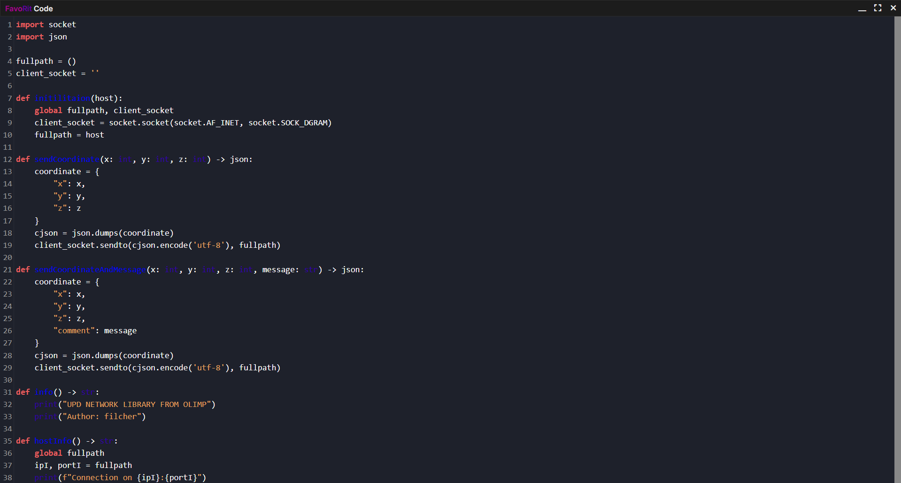

<p align="center"></p>
<h1 align="center">FavoRit Code</h1>

<div align="center">

[](#)
[](#)
[](#)

</div>

# Screenshot


# Download
```bash
# Clone repos
git clone https://github.com/filcherock/FavoRit-Code.git -b electron

# Go to the created directory
cd FavoRit-Code

# Establishing dependencies
npm install

# Start FavoRit Code
npm start
```

# License
FavoRit Code is licensed under the MIT License
